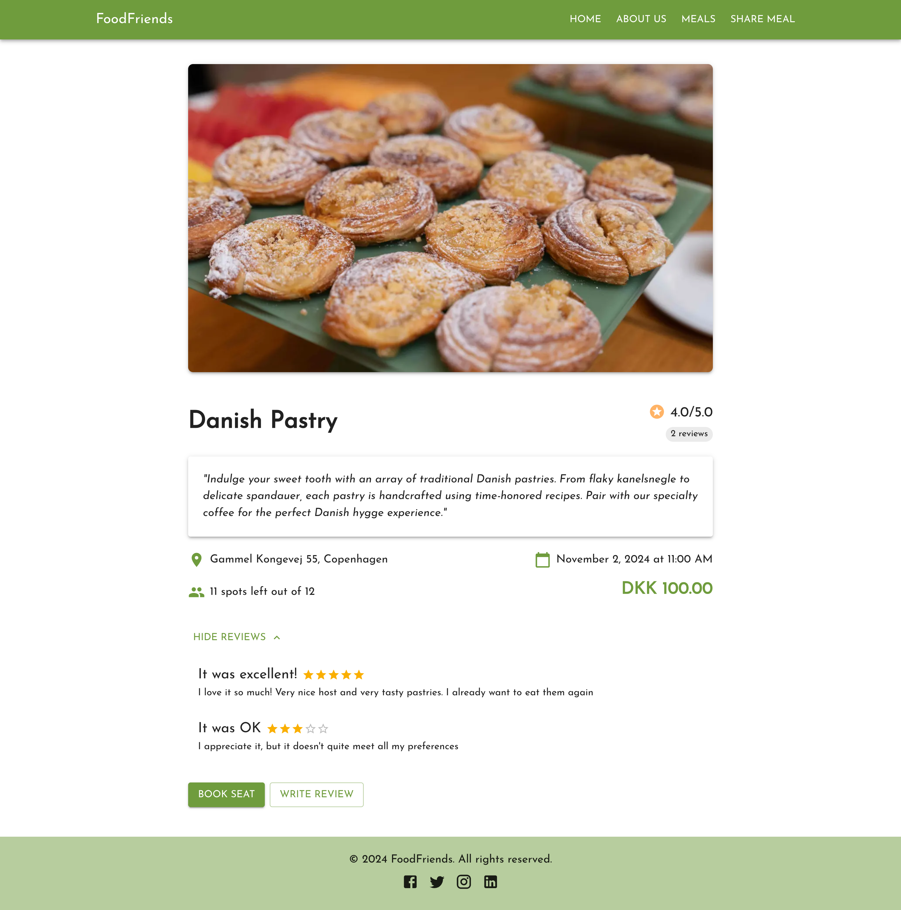

# FoodFriends

## Description

FoodFriends is a full-stack web application built with Next.js, React, and MySQL. It's designed to connect food enthusiasts, allowing them to share meals and experiences.

This project was created as part of study at HackYourFuture.

The application is deployed on Vercel.

## Deployed Application

🌐 [Visit FoodFriends](https://food-friends-jet.vercel.app/)

## Main Features

- Browse and search for shared meals
- View detailed information about each meal
- Make reservations for meals
- Leave reviews for meals you've experienced
- Add a meal with an image
- User-friendly interface built with Material-UI (MUI)

## Technologies Used

- **Frontend:**

  - Next.js
  - React
  - Material-UI (MUI)

- **Backend:**

  - Express.js
  - KnexJS
  - MySQL
  - AWS S3

## Screenshots

### Home Page

### About Us Page

### Meals Page

### Meal Page

### Share Meal Page

## Project Presentation

Click the image below to watch a project presentation:

